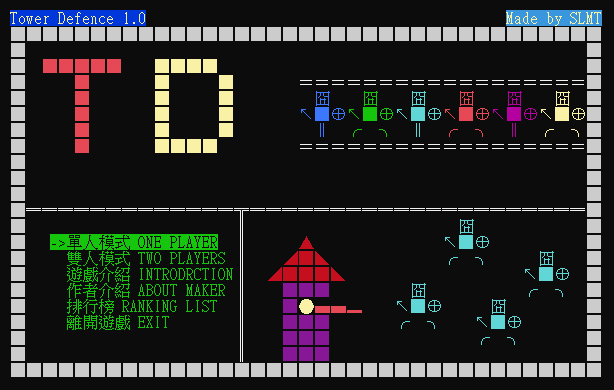

# Console Tower Defense Game



## Prerequisite

- For compiling the code: Any C/C++ Compiler + [Bazel](https://bazel.build/)
- For running the binary: Windows OS

## Build

Prerequisite: 

Navigate to the root directory of the project and enter the following command:

```
$ bazel build td_pkg
```

This will build the source code and package the binary along with all necessary data files into a zip file at `bazel-bin/td.zip`.
